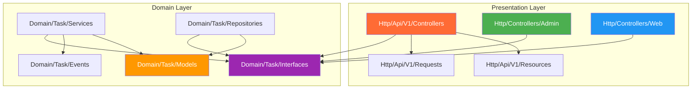

# 📊 Phân Tích Cấu Trúc Thư Mục API Theo DDD — Laravel Task Manager

## 🔧 Skills Áp Dụng

`api-design-principles`, `architecture`, `architecture-patterns`

---

## 1. Hiện Trạng Cấu Trúc Thư Mục

```
app/
├── Domain/                                  ← 🟡 Core Business Logic
│   ├── Task/
│   │   ├── Cache/
│   │   │   └── TaskCacheKeys.php
│   │   ├── Enums/
│   │   │   └── TaskStatus.php
│   │   ├── Events/
│   │   │   ├── TaskCreated.php
│   │   │   └── TaskStatusChanged.php
│   │   ├── Interfaces/
│   │   │   ├── Repositories/
│   │   │   │   └── TaskRepositoryInterface.php
│   │   │   └── Services/
│   │   │       ├── TaskCacheServiceInterface.php
│   │   │       └── TaskServiceInterface.php
│   │   ├── Listeners/
│   │   │   └── TaskCacheEventSubscriber.php
│   │   ├── Models/
│   │   │   ├── Task.php
│   │   │   └── TaskAttachment.php
│   │   ├── Repositories/
│   │   │   ├── CachingTaskRepository.php
│   │   │   └── TaskRepository.php
│   │   ├── Services/
│   │   │   ├── TaskCacheService.php
│   │   │   └── TaskService.php
│   │   └── Tests/                           ← EMPTY
│   │
│   ├── ActivityLog/
│   │   ├── Interfaces/{Repositories, Services}
│   │   ├── Models/
│   │   ├── Repositories/
│   │   ├── Services/
│   │   └── Traits/
│   │
│   └── AcitvityLog/                         ← ⚠️ TYPO DUPLICATE (empty)
│
├── Http/
│   ├── Api/
│   │   └── V1/
│   │       └── Controllers/                 ← EMPTY
│   │
│   ├── Controllers/
│   │   ├── Admin/
│   │   │   └── TaskController.php           ← Active (returns views)
│   │   ├── Api/
│   │   │   └── V1/                          ← EMPTY (duplicate path)
│   │   ├── Controller.php
│   │   └── User/                            ← EMPTY
│   │
│   ├── Middleware/
│   │   └── LogHttpRequest.php
│   │
│   └── Requests/
│       ├── Admin/
│       │   └── StoreTaskRequest.php
│       └── Web/
│           └── StoreTaskRequest.php
│
├── Models/
│   └── User.php                             ← Cross-domain entity
│
└── Providers/
    └── AppServiceProvider.php               ← All DI bindings here

routes/
├── admin.php                                ← apiResource (Admin web)
├── console.php
└── web.php                                  ← Not used for API
```

---

## 2. 🔍 Phát Hiện Vấn Đề

### ❌ Vấn Đề Nghiêm Trọng

| # | Vấn đề | Chi tiết |
|---|--------|----------|
| 1 | **Duplicate API controller paths** | Tồn tại 2 đường dẫn rỗng: `Http/Api/V1/Controllers/` VÀ `Http/Controllers/Api/V1/` → gây nhầm lẫn |
| 2 | **Không có route file cho API** | Không có `routes/api.php` → chưa có endpoint API thực sự |
| 3 | **Admin dùng `apiResource` nhưng return views** | [routes/admin.php](file:///e:/ProgramFiles/wamp/www/laravel-task-manager/routes/admin.php) dùng `apiResource` (JSON) nhưng controller trả về `view()` (HTML) → nên dùng `resource` thay `apiResource` |
| 4 | **Thư mục typo** | `AcitvityLog` (thiếu chữ 'i') tồn tại cùng với `ActivityLog` |
| 5 | **Thiếu API Resources** | Không có `TaskResource.php`, `TaskCollection.php` cho JSON response |
| 6 | **Thiếu API-specific Requests** | Requests chỉ có `Admin/` và `Web/`, chưa có `Api/` |

### ⚠️ Vấn Đề Cần Cải Thiện

| # | Vấn đề | Chi tiết |
|---|--------|----------|
| 7 | **DI tập trung** | Tất cả bindings trong [AppServiceProvider](file:///e:/ProgramFiles/wamp/www/laravel-task-manager/app/Providers/AppServiceProvider.php#20-50) → nên tách theo domain |
| 8 | **Không nhất quán naming convention** | Controllers: `Admin` vs [User](file:///e:/ProgramFiles/wamp/www/laravel-task-manager/app/Domain/Task/Cache/TaskCacheKeys.php#8-13) (empty) vs `Web` (trong Requests) |
| 9 | **Tests directory empty** | `Domain/Task/Tests/` tồn tại nhưng rỗng |
| 10 | **CachingTaskRepository chưa được bind** | [AppServiceProvider](file:///e:/ProgramFiles/wamp/www/laravel-task-manager/app/Providers/AppServiceProvider.php#20-50) bind [TaskRepository](file:///e:/ProgramFiles/wamp/www/laravel-task-manager/app/Domain/Task/Repositories/TaskRepository.php#9-62) trực tiếp, [CachingTaskRepository](file:///e:/ProgramFiles/wamp/www/laravel-task-manager/app/Domain/Task/Repositories/CachingTaskRepository.php#13-98) (Decorator pattern) chưa được wire |

---

## 3. ✅ Cấu Trúc Đề Xuất Chuẩn DDD Cho API

> [!IMPORTANT]
> Cấu trúc dưới đây tách biệt rõ ràng 3 tầng: **Domain Layer** (business logic thuần), **Application Layer** (use cases), và **Infrastructure/Presentation Layer** (HTTP, framework). API luôn nằm ở tầng Presentation, tách riêng hoàn toàn khỏi Web/Admin.

```
app/
├── Domain/                                    ← 🔵 CORE (Framework-Agnostic)
│   ├── Task/
│   │   ├── Models/                            ← Entities
│   │   │   ├── Task.php
│   │   │   └── TaskAttachment.php
│   │   ├── Enums/                             ← Value Objects
│   │   │   └── TaskStatus.php
│   │   ├── Events/                            ← Domain Events
│   │   │   ├── TaskCreated.php
│   │   │   └── TaskStatusChanged.php
│   │   ├── Interfaces/                        ← Contracts / Ports
│   │   │   ├── Repositories/
│   │   │   │   └── TaskRepositoryInterface.php
│   │   │   └── Services/
│   │   │       ├── TaskServiceInterface.php
│   │   │       └── TaskCacheServiceInterface.php
│   │   ├── Repositories/                      ← Concrete Implementations
│   │   │   ├── TaskRepository.php
│   │   │   └── CachingTaskRepository.php      ← Decorator Pattern
│   │   ├── Services/                          ← Domain Services
│   │   │   ├── TaskService.php
│   │   │   └── TaskCacheService.php
│   │   ├── Cache/                             ← Cache Strategy
│   │   │   └── TaskCacheKeys.php
│   │   ├── Listeners/                         ← Event Handlers
│   │   │   └── TaskCacheEventSubscriber.php
│   │   └── Exceptions/                        ← 🆕 Domain Exceptions
│   │       ├── TaskNotFoundException.php
│   │       └── TaskOperationException.php
│   │
│   ├── ActivityLog/
│   │   ├── Models/
│   │   ├── Interfaces/{Repositories, Services}
│   │   ├── Repositories/
│   │   ├── Services/
│   │   ├── Listeners/
│   │   └── Traits/
│   │
│   └── Shared/                                ← 🆕 Cross-Domain Concerns
│       ├── Interfaces/
│       │   └── PaginationInterface.php
│       └── ValueObjects/
│           └── PaginationParams.php
│
├── Http/                                      ← 🟢 PRESENTATION LAYER
│   │
│   ├── Api/                                   ← 🔶 API LAYER (tách riêng)
│   │   └── V1/                                ← Versioning
│   │       ├── Controllers/                   ← API Controllers
│   │       │   ├── TaskController.php         ← JSON responses only
│   │       │   └── AuthController.php
│   │       ├── Requests/                      ← 🆕 API-specific validation
│   │       │   ├── StoreTaskRequest.php
│   │       │   ├── UpdateTaskRequest.php
│   │       │   └── ListTaskRequest.php
│   │       └── Resources/                     ← 🆕 API Resources (JSON transform)
│   │           ├── TaskResource.php
│   │           └── TaskCollection.php
│   │
│   ├── Controllers/                           ← Web Controllers
│   │   ├── Admin/
│   │   │   ├── TaskController.php             ← return view()
│   │   │   └── ActivityLogController.php
│   │   ├── Web/                               ← 🔄 Đổi "User" → "Web" (nhất quán)
│   │   │   └── TaskController.php
│   │   └── Controller.php
│   │
│   ├── Middleware/
│   │   ├── LogHttpRequest.php
│   │   └── ForceJsonResponse.php              ← 🆕 Bắt buộc JSON cho API
│   │
│   └── Requests/                              ← Web Requests
│       ├── Admin/
│       │   ├── StoreTaskRequest.php
│       │   └── UpdateTaskRequest.php
│       └── Web/
│           ├── StoreTaskRequest.php
│           └── UpdateTaskRequest.php
│
├── Models/
│   └── User.php                               ← Cross-domain
│
└── Providers/
    ├── AppServiceProvider.php                  ← Bootstrap chung
    ├── TaskServiceProvider.php                 ← 🆕 DI cho Task domain
    └── ActivityLogServiceProvider.php          ← 🆕 DI cho ActivityLog domain

routes/
├── api.php                                    ← 🆕 API routes (prefix /api)
├── admin.php                                  ← Admin web routes
├── web.php                                    ← User web routes
└── console.php
```

---

## 4. 📐 Dependency Flow (Quy Tắc Phụ Thuộc)



> **Nguyên tắc DDD**: Mũi tên hướng vào trong (→ Interfaces). Controllers phụ thuộc Interfaces, KHÔNG phụ thuộc concrete implementations. Repositories và Services implement Interfaces.

---

## 5. 🔶 Chi Tiết API Layer — Best Practice

### 5.1 API Controller (Chỉ trả JSON)

```php
// app/Http/Api/V1/Controllers/TaskController.php
namespace App\Http\Api\V1\Controllers;

use App\Domain\Task\Interfaces\Services\TaskServiceInterface;
use App\Http\Api\V1\Requests\StoreTaskRequest;
use App\Http\Api\V1\Requests\UpdateTaskRequest;
use App\Http\Api\V1\Resources\TaskResource;
use App\Http\Api\V1\Resources\TaskCollection;
use App\Http\Controllers\Controller;
use Illuminate\Http\JsonResponse;
use Symfony\Component\HttpFoundation\Response;

class TaskController extends Controller
{
    public function __construct(
        private readonly TaskServiceInterface $taskService
    ) {}

    public function index(): TaskCollection
    {
        $tasks = $this->taskService->getAllPaginated();
        return new TaskCollection($tasks);
    }

    public function store(StoreTaskRequest $request): JsonResponse
    {
        $task = $this->taskService->create($request->validated());
        return TaskResource::make($task)
            ->response()
            ->setStatusCode(Response::HTTP_CREATED);
    }

    public function show(int $id): TaskResource
    {
        $task = $this->taskService->findOrFail($id);
        return new TaskResource($task);
    }

    public function update(UpdateTaskRequest $request, int $id): TaskResource
    {
        $task = $this->taskService->update($id, $request->validated());
        return new TaskResource($task);
    }

    public function destroy(int $id): JsonResponse
    {
        $this->taskService->delete($id);
        return response()->json(null, Response::HTTP_NO_CONTENT);
    }
}
```

### 5.2 API Resource (Transform Layer)

```php
// app/Http/Api/V1/Resources/TaskResource.php
namespace App\Http\Api\V1\Resources;

use Illuminate\Http\Request;
use Illuminate\Http\Resources\Json\JsonResource;

class TaskResource extends JsonResource
{
    public function toArray(Request $request): array
    {
        return [
            'id'          => $this->id,
            'title'       => $this->title,
            'description' => $this->description,
            'content'     => $this->content,
            'status'      => $this->status->value,
            'status_label'=> $this->status->label(),
            'due_date'    => $this->due_date?->toIso8601String(),
            'user'        => [
                'id'   => $this->user?->id,
                'name' => $this->user?->name,
            ],
            'assignee'    => $this->whenLoaded('assignee', fn() => [
                'id'   => $this->assignee->id,
                'name' => $this->assignee->name,
            ]),
            'created_at'  => $this->created_at->toIso8601String(),
            'updated_at'  => $this->updated_at->toIso8601String(),
        ];
    }
}
```

```php
// app/Http/Api/V1/Resources/TaskCollection.php
namespace App\Http\Api\V1\Resources;

use Illuminate\Http\Resources\Json\ResourceCollection;

class TaskCollection extends ResourceCollection
{
    public $collects = TaskResource::class;
}
```

### 5.3 API Route (Versioned)

```php
// routes/api.php
use Illuminate\Support\Facades\Route;
use App\Http\Api\V1\Controllers\TaskController;

Route::prefix('v1')->group(function () {
    Route::middleware(['auth:sanctum'])->group(function () {
        Route::apiResource('tasks', TaskController::class);
    });
});
```

### 5.4 Domain ServiceProvider (Tách DI)

```php
// app/Providers/TaskServiceProvider.php
namespace App\Providers;

use Illuminate\Support\ServiceProvider;
use App\Domain\Task\Interfaces\Services\TaskServiceInterface;
use App\Domain\Task\Interfaces\Services\TaskCacheServiceInterface;
use App\Domain\Task\Interfaces\Repositories\TaskRepositoryInterface;
use App\Domain\Task\Services\TaskService;
use App\Domain\Task\Services\TaskCacheService;
use App\Domain\Task\Repositories\TaskRepository;
use App\Domain\Task\Repositories\CachingTaskRepository;
use Illuminate\Cache\CacheManager;

class TaskServiceProvider extends ServiceProvider
{
    public function register(): void
    {
        // Repository: TaskRepository → CachingTaskRepository (Decorator)
        $this->app->bind(TaskRepositoryInterface::class, function ($app) {
            return new CachingTaskRepository(
                $app->make(TaskRepository::class),
                $app->make(CacheManager::class)
            );
        });

        $this->app->bind(TaskServiceInterface::class, TaskService::class);
        $this->app->bind(TaskCacheServiceInterface::class, TaskCacheService::class);
    }
}
```

---

## 6. 📋 So Sánh: Hiện Trạng vs Đề Xuất

| Tiêu chí | Hiện Trạng | Đề Xuất |
|-----------|-----------|---------|
| **API Controller location** | 2 thư mục rỗng conflict | `Http/Api/V1/Controllers/` duy nhất |
| **API Routes** | Không có `api.php` | `routes/api.php` với versioning |
| **JSON Transform** | Chưa có Resources | `TaskResource` + `TaskCollection` |
| **API Validation** | Chưa có | `Http/Api/V1/Requests/` riêng |
| **DI Organization** | Tất cả trong [AppServiceProvider](file:///e:/ProgramFiles/wamp/www/laravel-task-manager/app/Providers/AppServiceProvider.php#20-50) | Tách `TaskServiceProvider`, `ActivityLogServiceProvider` |
| **Cache Decorator** | Code có nhưng chưa wire | Bind qua closure trong ServiceProvider |
| **Naming Convention** | [User/](file:///e:/ProgramFiles/wamp/www/laravel-task-manager/app/Domain/Task/Cache/TaskCacheKeys.php#8-13) (empty) ≠ `Web/` (Requests) | Thống nhất `Web/` |
| **Admin route type** | `apiResource` (sai) | `resource` cho web, `apiResource` cho API |
| **Domain Exceptions** | Chưa có | Custom exceptions cho từng domain |
| **Typo directory** | `AcitvityLog` tồn tại | Xóa thư mục typo |

---

## 7. 🎯 Nguyên Tắc DDD Cốt Lõi Áp Dụng

| Nguyên Tắc | Áp Dụng Trong Project |
|------------|----------------------|
| **SRP** (Single Responsibility) | Mỗi Controller chỉ phục vụ 1 context (Admin/Web/Api) |
| **OCP** (Open/Closed) | Thêm API V2 = tạo `Api/V2/` mới, không sửa V1 |
| **LSP** (Liskov Substitution) | [CachingTaskRepository](file:///e:/ProgramFiles/wamp/www/laravel-task-manager/app/Domain/Task/Repositories/CachingTaskRepository.php#13-98) thay thế [TaskRepository](file:///e:/ProgramFiles/wamp/www/laravel-task-manager/app/Domain/Task/Repositories/TaskRepository.php#9-62) qua Interface |
| **ISP** (Interface Segregation) | [TaskServiceInterface](file:///e:/ProgramFiles/wamp/www/laravel-task-manager/app/Domain/Task/Interfaces/Services/TaskServiceInterface.php#8-22) tách riêng `TaskCacheServiceInterface` |
| **DIP** (Dependency Inversion) | Controllers depend on Interfaces, NOT concrete classes |
| **Ubiquitous Language** | Namespace phản ánh business domain: `Domain\Task\Events\TaskCreated` |
| **Bounded Context** | [Task](file:///e:/ProgramFiles/wamp/www/laravel-task-manager/app/Domain/Task/Models/Task.php#13-82) và `ActivityLog` là 2 bounded context tách biệt |
| **Anti-Corruption Layer** | API Resources transform Domain Models → API response format |

---

## 8. 🔑 Action Items (Ưu Tiên)

1. **Tạo `routes/api.php`** và đăng ký trong [bootstrap/app.php](file:///e:/ProgramFiles/wamp/www/laravel-task-manager/bootstrap/app.php)
2. **Tạo API Controller** tại `Http/Api/V1/Controllers/TaskController.php`
3. **Tạo API Resources** (`TaskResource.php`, `TaskCollection.php`)
4. **Tạo API Requests** tại `Http/Api/V1/Requests/`
5. **Tách ServiceProviders** (`TaskServiceProvider`, `ActivityLogServiceProvider`)
6. **Wire CachingTaskRepository** qua Decorator pattern trong ServiceProvider
7. **Xóa thư mục rỗng/duplicate**: `AcitvityLog/`, `Http/Controllers/Api/`, `Http/Controllers/User/`
8. **Đổi `apiResource` → `resource`** trong [routes/admin.php](file:///e:/ProgramFiles/wamp/www/laravel-task-manager/routes/admin.php)
9. **Thêm `ForceJsonResponse` middleware** cho API routes
10. **Thêm Domain Exceptions** cho error handling rõ ràng
