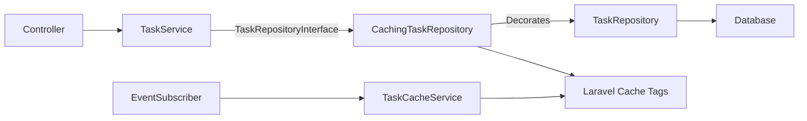

# Task Cache Implementation — Decorator Pattern + Cache Tags (Refined)

## Background

Hiện tại project Task Manager đã có [TaskCacheKeys.php](file:///e:/ProgramFiles/wamp/www/laravel-task-manager/app/Domain/Task/Cache/TaskCacheKeys.php) hoàn chỉnh, nhưng các file còn lại ([CachingTaskRepository.php](file:///e:/ProgramFiles/wamp/www/laravel-task-manager/app/Domain/Task/Repositories/CachingTaskRepository.php), [TaskCacheService.php](file:///e:/ProgramFiles/wamp/www/laravel-task-manager/app/Domain/Task/Services/TaskCacheService.php), [TaskCacheServiceInterface.php](file:///e:/ProgramFiles/wamp/www/laravel-task-manager/app/Domain/Task/Interfaces/Services/TaskCacheServiceInterface.php), [TaskCacheEventSubscriber.php](file:///e:/ProgramFiles/wamp/www/laravel-task-manager/app/Domain/Task/Listeners/TaskCacheEventSubscriber.php)) đều **empty** (0 bytes). [AppServiceProvider.php](file:///e:/ProgramFiles/wamp/www/laravel-task-manager/app/Providers/AppServiceProvider.php) vẫn bind trực tiếp [TaskRepository](file:///e:/ProgramFiles/wamp/www/laravel-task-manager/app/Domain/Task/Repositories/TaskRepository.php#9-62).

**Skills sử dụng**: `architecture` (Architectural decision-making framework)

### Vấn đề trong plan cũ ([docs/implementation_plan.md](file:///e:/ProgramFiles/wamp/www/laravel-task-manager/docs/implementation_plan.md)) đã sửa:

| # | Vấn đề cũ | Cách sửa |
|---|-----------|----------|
| 1 | `request()` helper trong Repository — vi phạm separation of concerns | Dùng `Paginator::resolveCurrentPage()` (Laravel internal, không phụ thuộc HTTP) |
| 2 | Dual invalidation: `CachingTaskRepository` flush + Event Subscriber cũng flush | Chỉ invalidate tại **CachingTaskRepository** (decorator). Event Subscriber dùng cho external triggers (artisan commands, jobs) |
| 3 | [create()](file:///e:/ProgramFiles/wamp/www/laravel-task-manager/app/Domain/Task/Interfaces/Services/TaskServiceInterface.php#16-17) flush `TAG_ALL_TASKS` xóa toàn bộ cache quá aggressive | Flush chỉ các list tags, giữ lại task detail caches không liên quan |
| 4 | [findOrFail](file:///e:/ProgramFiles/wamp/www/laravel-task-manager/app/Domain/Task/Interfaces/Repositories/TaskRepositoryInterface.php#14-15) cần user tag nhưng chưa biết userId | Load task trước → lấy `user_id` → cache với user tag |
| 5 | Wrong file paths references | Sửa tất cả path về `e:\ProgramFiles\wamp\www\laravel-task-manager` |

## Architecture



| SOLID | Áp dụng |
|-------|---------|
| **S** | [TaskRepository](file:///e:/ProgramFiles/wamp/www/laravel-task-manager/app/Domain/Task/Repositories/TaskRepository.php#9-62) chỉ query DB, `CachingTaskRepository` chỉ quản lý cache |
| **O** | Không sửa [TaskRepository](file:///e:/ProgramFiles/wamp/www/laravel-task-manager/app/Domain/Task/Repositories/TaskRepository.php#9-62) gốc, wrap bằng decorator |
| **L** | `CachingTaskRepository` implement cùng [TaskRepositoryInterface](file:///e:/ProgramFiles/wamp/www/laravel-task-manager/app/Domain/Task/Interfaces/Repositories/TaskRepositoryInterface.php#8-24) |
| **I** | Dùng chung interface, `TaskCacheServiceInterface` tách riêng manual flush |
| **D** | Service depend interface, không biết concrete |

### Cache Key & Tag Strategy

| Cache Key | Tags | Mô tả |
|-----------|------|--------|
| `tasks:all:page:{page}:per:{perPage}` | `['tasks']` | Danh sách tất cả tasks |
| `tasks:user:{userId}:page:{page}:per:{perPage}` | `['tasks', 'tasks:user:{userId}']` | Tasks của 1 user |
| `tasks:detail:{id}` | `['tasks', 'tasks:user:{userId}', 'tasks:item:{id}']` | Chi tiết 1 task |

### Invalidation Strategy

| Action | Invalidation | Lý do |
|--------|-------------|-------|
| [create(data)](file:///e:/ProgramFiles/wamp/www/laravel-task-manager/app/Domain/Task/Interfaces/Services/TaskServiceInterface.php#16-17) | Flush `TAG_ALL_TASKS` | Task mới → tất cả danh sách cần refresh. Flush toàn bộ là đúng vì không biết task mới thuộc page nào |
| [update(id, data)](file:///e:/ProgramFiles/wamp/www/laravel-task-manager/app/Domain/Task/Interfaces/Repositories/TaskRepositoryInterface.php#18-19) | Flush `TAG_ALL_TASKS` | Status/data thay đổi có thể ảnh hưởng sort order → flush all lists + details |
| [updateByModel(task, data)](file:///e:/ProgramFiles/wamp/www/laravel-task-manager/app/Domain/Task/Interfaces/Repositories/TaskRepositoryInterface.php#20-21) | Flush `TAG_ALL_TASKS` | Tương tự update |
| [delete(id)](file:///e:/ProgramFiles/wamp/www/laravel-task-manager/app/Domain/Task/Services/TaskService.php#69-73) | Flush `TAG_ALL_TASKS` | Task bị xóa → danh sách cần refresh |
| Manual: `flushForUser(userId)` | Flush `tasks:user:{userId}` tag | Chỉ xóa cache liên quan user đó |
| Manual: `flushForTask(taskId)` | Flush `tasks:item:{taskId}` tag | Chỉ xóa cache 1 task chi tiết |

> [!IMPORTANT]
> Cache Tags **chỉ hỗ trợ** driver `redis` hoặc `memcached`. Driver `database` hiện tại **không hỗ trợ tags**. Cần set `CACHE_STORE=redis` trong `.env`.

---

## Proposed Changes

### Cache Infrastructure (đã có)

#### [KEEP] [TaskCacheKeys.php](file:///e:/ProgramFiles/wamp/www/laravel-task-manager/app/Domain/Task/Cache/TaskCacheKeys.php)
File này đã được implement đúng, không cần thay đổi.

---

### Repository Layer — Decorator

#### [MODIFY] [CachingTaskRepository.php](file:///e:/ProgramFiles/wamp/www/laravel-task-manager/app/Domain/Task/Repositories/CachingTaskRepository.php)

File hiện tại empty. Ghi đầy đủ nội dung:

```php
<?php

namespace App\Domain\Task\Repositories;

use App\Domain\Task\Cache\TaskCacheKeys;
use App\Domain\Task\Interfaces\Repositories\TaskRepositoryInterface;
use App\Domain\Task\Models\Task;
use Illuminate\Cache\CacheManager;
use Illuminate\Contracts\Pagination\LengthAwarePaginator;
use Illuminate\Pagination\Paginator;

class CachingTaskRepository implements TaskRepositoryInterface
{
    public function __construct(
        private readonly TaskRepositoryInterface $inner,
        private readonly CacheManager $cache,
    ) {}

    // -------------------------------------------------------
    // Read Methods — check cache → miss → delegate → store
    // -------------------------------------------------------

    public function getAllPaginated(int $perPage = 15): LengthAwarePaginator
    {
        $page = Paginator::resolveCurrentPage();
        $key  = TaskCacheKeys::allTasksPaginated($page, $perPage);

        return $this->cache
            ->tags([TaskCacheKeys::TAG_ALL_TASKS])
            ->remember($key, TaskCacheKeys::DEFAULT_TTL, function () use ($perPage) {
                return $this->inner->getAllPaginated($perPage);
            });
    }

    public function getByUserPaginated(int $userId, int $perPage = 15): LengthAwarePaginator
    {
        $page = Paginator::resolveCurrentPage();
        $key  = TaskCacheKeys::userTasksPaginated($userId, $page, $perPage);

        return $this->cache
            ->tags([TaskCacheKeys::TAG_ALL_TASKS, TaskCacheKeys::tagForUser($userId)])
            ->remember($key, TaskCacheKeys::DEFAULT_TTL, function () use ($userId, $perPage) {
                return $this->inner->getByUserPaginated($userId, $perPage);
            });
    }

    public function findOrFail(int $id): Task
    {
        $key = TaskCacheKeys::taskDetail($id);

        // Bước 1: Thử lấy từ cache trước (dùng TAG_ALL_TASKS chung vì chưa biết userId)
        $cachedTask = $this->cache
            ->tags([TaskCacheKeys::TAG_ALL_TASKS])
            ->get($key);

        if ($cachedTask !== null) {
            return $cachedTask;
        }

        // Bước 2: Cache miss → query DB → lấy userId → cache với đầy đủ tags
        $task = $this->inner->findOrFail($id);

        $this->cache
            ->tags([
                TaskCacheKeys::TAG_ALL_TASKS,
                TaskCacheKeys::tagForUser($task->user_id),
                TaskCacheKeys::tagForItem($id),
            ])
            ->put($key, $task, TaskCacheKeys::DEFAULT_TTL);

        return $task;
    }

    // -------------------------------------------------------
    // Write Methods — delegate → invalidate related cache
    // -------------------------------------------------------

    public function create(array $data): Task
    {
        $task = $this->inner->create($data);

        // Task mới → flush tất cả list caches (sort order có thể thay đổi)
        $this->cache->tags([TaskCacheKeys::TAG_ALL_TASKS])->flush();

        return $task;
    }

    public function update(int $id, array $data): bool
    {
        $result = $this->inner->update($id, $data);

        // Data thay đổi → flush all (vì ảnh hưởng list + detail)
        $this->cache->tags([TaskCacheKeys::TAG_ALL_TASKS])->flush();

        return $result;
    }

    public function updateByModel(Task $task, array $data): Task
    {
        $result = $this->inner->updateByModel($task, $data);

        $this->cache->tags([TaskCacheKeys::TAG_ALL_TASKS])->flush();

        return $result;
    }

    public function delete(int $id): bool
    {
        $result = $this->inner->delete($id);

        $this->cache->tags([TaskCacheKeys::TAG_ALL_TASKS])->flush();

        return $result;
    }
}
```

**Điểm cải tiến so với plan cũ:**
- Dùng `Paginator::resolveCurrentPage()` thay vì `request()->input('page', 1)` — không vi phạm separation of concerns
- [findOrFail()](file:///e:/ProgramFiles/wamp/www/laravel-task-manager/app/Domain/Task/Interfaces/Repositories/TaskRepositoryInterface.php#14-15) dùng 2-step approach: check cache với tag chung → nếu miss, load từ DB → cache lại với đầy đủ tags (bao gồm user tag)

---

### Cache Service — Manual Control

#### [MODIFY] [TaskCacheServiceInterface.php](file:///e:/ProgramFiles/wamp/www/laravel-task-manager/app/Domain/Task/Interfaces/Services/TaskCacheServiceInterface.php)

```php
<?php

namespace App\Domain\Task\Interfaces\Services;

interface TaskCacheServiceInterface
{
    /**
     * Xóa TẤT CẢ cache liên quan tới Task.
     */
    public function flushAll(): void;

    /**
     * Xóa cache tất cả Task liên quan tới user cụ thể.
     */
    public function flushForUser(int $userId): void;

    /**
     * Xóa cache chi tiết 1 task cụ thể.
     */
    public function flushForTask(int $taskId): void;
}
```

#### [MODIFY] [TaskCacheService.php](file:///e:/ProgramFiles/wamp/www/laravel-task-manager/app/Domain/Task/Services/TaskCacheService.php)

```php
<?php

namespace App\Domain\Task\Services;

use App\Domain\Task\Cache\TaskCacheKeys;
use App\Domain\Task\Interfaces\Services\TaskCacheServiceInterface;
use Illuminate\Cache\CacheManager;

class TaskCacheService implements TaskCacheServiceInterface
{
    public function __construct(
        private readonly CacheManager $cache,
    ) {}

    /**
     * Xóa TẤT CẢ cache liên quan tới Task.
     *
     * Flush tag `tasks` → xóa mọi cache entry có tag này.
     */
    public function flushAll(): void
    {
        $this->cache->tags([TaskCacheKeys::TAG_ALL_TASKS])->flush();
    }

    /**
     * Xóa cache tất cả Task liên quan tới user cụ thể.
     *
     * Flush tag `tasks:user:{userId}` → chỉ xóa cache entries
     * được tag với user này (danh sách user + task details của user).
     * Cache của user khác không bị ảnh hưởng.
     */
    public function flushForUser(int $userId): void
    {
        $this->cache->tags([TaskCacheKeys::tagForUser($userId)])->flush();
    }

    /**
     * Xóa cache chi tiết 1 task cụ thể.
     *
     * Flush tag `tasks:item:{taskId}` → chỉ xóa cache entry
     * chi tiết của task này. Danh sách và cache task khác không bị ảnh hưởng.
     */
    public function flushForTask(int $taskId): void
    {
        $this->cache->tags([TaskCacheKeys::tagForItem($taskId)])->flush();
    }
}
```

---

### Event-Driven Cache Invalidation

#### [MODIFY] [TaskCacheEventSubscriber.php](file:///e:/ProgramFiles/wamp/www/laravel-task-manager/app/Domain/Task/Listeners/TaskCacheEventSubscriber.php)

Event Subscriber dùng `TaskCacheServiceInterface` thay vì trực tiếp dùng `CacheManager` — tuân thủ DIP và tránh duplicate logic.

```php
<?php

namespace App\Domain\Task\Listeners;

use App\Domain\Task\Events\TaskCreated;
use App\Domain\Task\Events\TaskStatusChanged;
use App\Domain\Task\Interfaces\Services\TaskCacheServiceInterface;
use Illuminate\Contracts\Events\Dispatcher;

class TaskCacheEventSubscriber
{
    public function __construct(
        private readonly TaskCacheServiceInterface $cacheService,
    ) {}

    /**
     * Task mới tạo → flush tất cả cache Task (danh sách cần cập nhật).
     */
    public function handleTaskCreated(TaskCreated $event): void
    {
        $this->cacheService->flushAll();
    }

    /**
     * Status thay đổi → flush cache task cụ thể + danh sách.
     */
    public function handleTaskStatusChanged(TaskStatusChanged $event): void
    {
        $this->cacheService->flushAll();
    }

    /**
     * Đăng ký các event listeners.
     *
     * @return array<string, string>
     */
    public function subscribe(Dispatcher $events): array
    {
        return [
            TaskCreated::class       => 'handleTaskCreated',
            TaskStatusChanged::class => 'handleTaskStatusChanged',
        ];
    }
}
```

> [!NOTE]
> **Về Dual Invalidation**: Khi `TaskService::create()` gọi `$this->repository->create()`, cache bị flush bởi `CachingTaskRepository`. Sau đó event [TaskCreated](file:///e:/ProgramFiles/wamp/www/laravel-task-manager/app/Domain/Task/Events/TaskCreated.php#9-17) dispatch → subscriber cũng flush. Đây là **idempotent** (flush 2 lần không có side-effect xấu) và cần thiết vì:
> - CachingTaskRepository flush ngay lập tức → đảm bảo consistency
> - Event Subscriber xử lý cases bên ngoài (queued jobs, seeders, artisan commands dispatch events mà không đi qua CachingTaskRepository)

---

### DI Binding

#### [MODIFY] [AppServiceProvider.php](file:///e:/ProgramFiles/wamp/www/laravel-task-manager/app/Providers/AppServiceProvider.php)

```diff
 <?php

 namespace App\Providers;

 use App\Domain\ActivityLog\Interfaces\Services\ActivityLogServiceInterface;
 use App\Domain\ActivityLog\Services\ActivityLogService;
 use App\Domain\ActivityLog\Interfaces\Repositories\ActivityLogRepositoryInterface;
 use App\Domain\ActivityLog\Repositories\ActivityLogRepository;

 use App\Domain\Task\Interfaces\Services\TaskServiceInterface;
 use App\Domain\Task\Services\TaskService;

-// use App\Domain\Task\Interfaces\Services\TaskAttachmentServiceInterface;
-// use App\Domain\Task\Services\TaskAttachmentService;
 use App\Domain\Task\Interfaces\Repositories\TaskRepositoryInterface;
 use App\Domain\Task\Repositories\TaskRepository;
+use App\Domain\Task\Repositories\CachingTaskRepository;
+use App\Domain\Task\Models\Task;
+use App\Domain\Task\Interfaces\Services\TaskCacheServiceInterface;
+use App\Domain\Task\Services\TaskCacheService;
+use App\Domain\Task\Listeners\TaskCacheEventSubscriber;
+use Illuminate\Cache\CacheManager;
+use Illuminate\Support\Facades\Event;

 use Illuminate\Support\ServiceProvider;

 class AppServiceProvider extends ServiceProvider
 {
     public function register(): void
     {
         // Task Domain
         $this->app->bind(TaskServiceInterface::class, TaskService::class);
-        $this->app->bind(TaskRepositoryInterface::class, TaskRepository::class);
+        $this->app->bind(TaskRepositoryInterface::class, function ($app) {
+            return new CachingTaskRepository(
+                inner: new TaskRepository($app->make(Task::class)),
+                cache: $app->make(CacheManager::class),
+            );
+        });

-        // Task Attachment Domain
-        // $this->app->bind(TaskAttachmentServiceInterface::class, TaskAttachmentService::class);
-        // $this->app->bind(TaskAttachmentRepositoryInterface::class, TaskAttachmentRepository::class);
+        // Task Cache Service
+        $this->app->bind(TaskCacheServiceInterface::class, TaskCacheService::class);

         // ActivityLog Domain
         $this->app->bind(ActivityLogServiceInterface::class, ActivityLogService::class);
         $this->app->bind(ActivityLogRepositoryInterface::class, ActivityLogRepository::class);
     }

     public function boot(): void
     {
-        //
+        Event::subscribe(TaskCacheEventSubscriber::class);
     }
 }
```

---

## File Summary

| # | Action | File | Purpose |
|---|--------|------|---------|
| 1 | KEEP | [TaskCacheKeys.php](file:///e:/ProgramFiles/wamp/www/laravel-task-manager/app/Domain/Task/Cache/TaskCacheKeys.php) | Cache key & tag constants (đã có) |
| 2 | MODIFY | [CachingTaskRepository.php](file:///e:/ProgramFiles/wamp/www/laravel-task-manager/app/Domain/Task/Repositories/CachingTaskRepository.php) | Decorator pattern (hiện empty → ghi đầy đủ) |
| 3 | MODIFY | [TaskCacheServiceInterface.php](file:///e:/ProgramFiles/wamp/www/laravel-task-manager/app/Domain/Task/Interfaces/Services/TaskCacheServiceInterface.php) | Cache service interface (hiện empty → ghi đầy đủ) |
| 4 | MODIFY | [TaskCacheService.php](file:///e:/ProgramFiles/wamp/www/laravel-task-manager/app/Domain/Task/Services/TaskCacheService.php) | Manual cache flush API (hiện empty → ghi đầy đủ) |
| 5 | MODIFY | [TaskCacheEventSubscriber.php](file:///e:/ProgramFiles/wamp/www/laravel-task-manager/app/Domain/Task/Listeners/TaskCacheEventSubscriber.php) | Event-driven invalidation (hiện empty → ghi đầy đủ) |
| 6 | MODIFY | [AppServiceProvider.php](file:///e:/ProgramFiles/wamp/www/laravel-task-manager/app/Providers/AppServiceProvider.php) | DI bindings + event subscriber |

---

## Verification Plan

### Automated Tests

Chạy PHPUnit để kiểm tra regression:

```bash
cd e:\ProgramFiles\wamp\www\laravel-task-manager
php artisan test
```

### Manual Verification

> [!IMPORTANT]
> **Yêu cầu**: Cần cài Redis và set `CACHE_STORE=redis` trong `.env` trước khi test Cache Tags. Nếu chưa có Redis, có thể test syntax bằng `CACHE_STORE=array` (tags hoạt động trong memory nhưng không persist giữa requests).

1. **Verify syntax**: `php artisan tinker` → chạy `app(TaskCacheServiceInterface::class)->flushAll();` → nếu không error → DI binding + class đúng
2. **Verify class resolution**: `php artisan tinker` → `app(TaskRepositoryInterface::class)` → phải return `CachingTaskRepository` instance
3. **Verify cache operations**: Tạo task → gọi list → kiểm tra cache bằng Redis CLI hoặc `Cache::tags(['tasks'])->get('tasks:all:page:1:per:15')`
